# Build Basic Generative Adversarial Networks (GANs)

## Week 1

### Generative Models
- 2 components, generators and and discriminators that compete against one another
- GANs are a _type_ of generative model
- Discriminative models often called _classifiers_
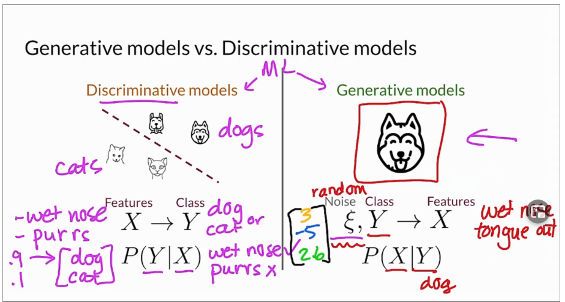
- Generative models usually try to create a realistic representation of some class
   - Takes a set of noise values as input, sometimes in a vector
      - So generator doesn't generate the same class features each time
   - May also take an input class
   - Goal: generate a set of features that look like the real class
- Many types of generative models
   - Variational AutoEncoders (VAEs)
      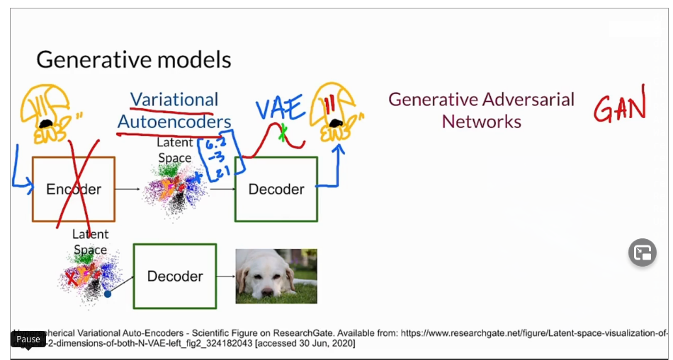
       - Works with 2 models, usually NNs
       - Encoder - represents input image in latent space
          - Location can be represented as a vector of numbers
          - Generated a distribution of locations, and picks a point in the sitro to pass to decoder
       - Decoder - runs after encoder on encoded point, or some point close to it to generate
         something that belongs to the class
          - Assumes Decoder has been trained well to genewrate good class members
       - Once trained, Encoder isn't needed any more.  Just use decoder to generate
         class members
   - Generative Adversarial Networks (GANs)
      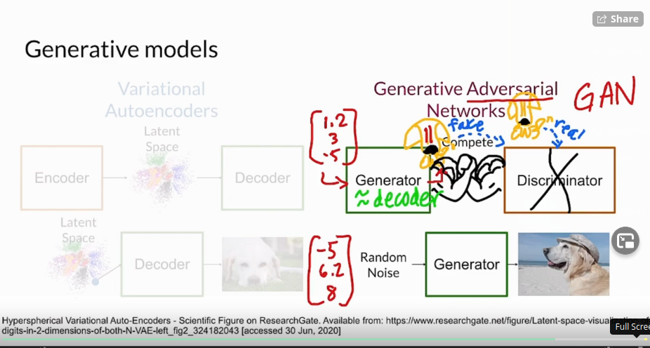
      - 2 models as well
      - Generator
         - Generator takes in noise vector as well, and an optional class member
         - Role is very similar to Decoder in VAE
      - Discriminator
         - Unsupervised
         - Looking at fake and real class members, tring to discriminate
      - Over time, Generator and Discriminator compete against each other
      - At some point, can drop the discriminator, and generator can take in any random noise 
        to generate a believable class member
- Generative models learn to produce _realistic_ class members
- Discriminative models distinguish between classes

### Real Life GANs
- Ian Goodfellow - creator of GANs
- GANs can:
   - Transform images from one domain to another (e.g. horse <-> zebra)
   - Make rough drawings photo-realistic
   - Take a still portrait, and animate it, using a real person's face
   - Generate 3D object designs

### Intuition behind GANs
- Generator creates fakes that appear real to fool the discriminator
- Discriminator learns to discriminate between reall class members and fakes
- GAN starts with a set of real members
   - Generator isn't allowed access to the real member set
   - Discriminator originally can't tell real from fake
- Begin training the descriminator with a mix of real and fake
   - 5% real
   - 40% fake
   - Provide labels to supervise the learning process
- Generator learns to create better fakes by looking at member classification scores
  from the discriminator
- Training continues until GAN reaches the threshold of success required

### The Discriminator
- A Discriminator is a type of classifier
   - Classifiers distinguish between different classes
   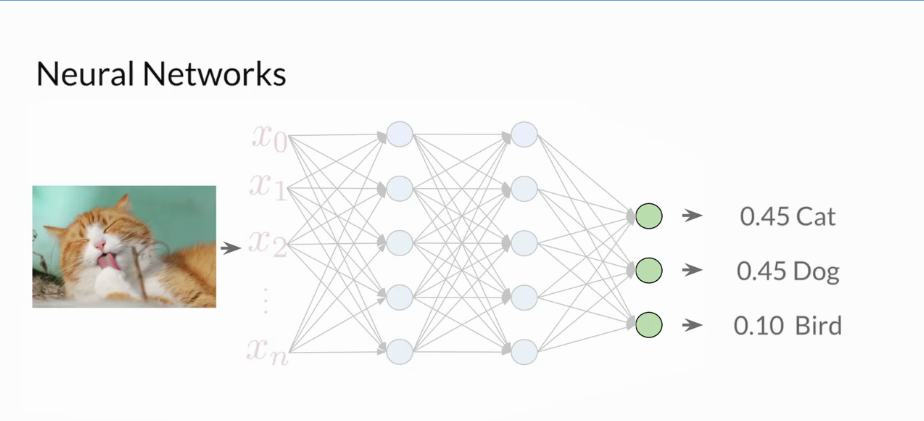
   - One type of classifier model is a _neural network_
      - Takes a set of features as input
      - Performs non-linear transformations in the hidden layers
      - Outputs probabilities for each classification
   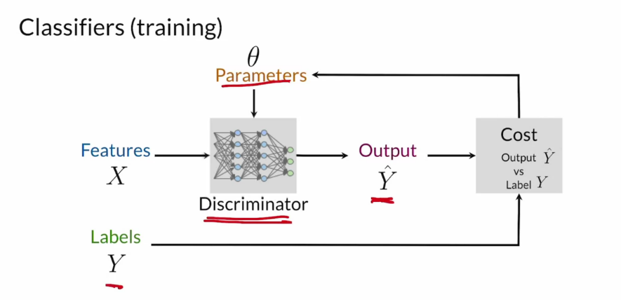
   - Training a classifier
      - 2 inputs:
         - Feature vector (X)
         - _theta_ - weights for the nodes of the NN (a.k.a. parameters)
            - Changes over time during learning
            - Trying to map Features (X) to Labels(Y)
      - Predictions are _yHat_, becaue they are guesses, not the real labels (Y) for the
        feature set
      - Goal: minimize the difference between _Y_ and _yHat_
      - Cost function indicates how close _Y_ and _yHat_ are
      - Update the parameters (theta) according to the _gradient_ of the cost function
         - _gradient_ indicates the direction in which _theta_ needs to move
      - Repeat this process until the cost function is sufficiently low
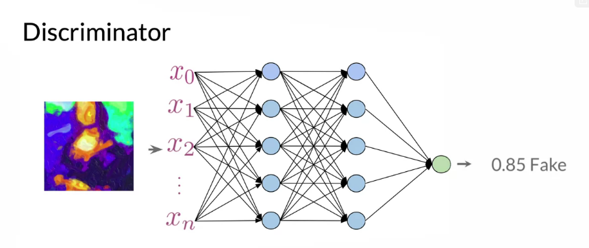
- The Discriminator is a classifier that inspects the examples, and determines if 
  they belong to the _real_ or _fake_ class, depending on the _conditional probability_ $P(Y|X)$
- Probabilities generated by the Discriminator are the feedback for the Generator

### The Generator
- Goal: generates examples of a certain class
- Input noise vector introduces variability in generated images
- Sometimes include the target class as input as well
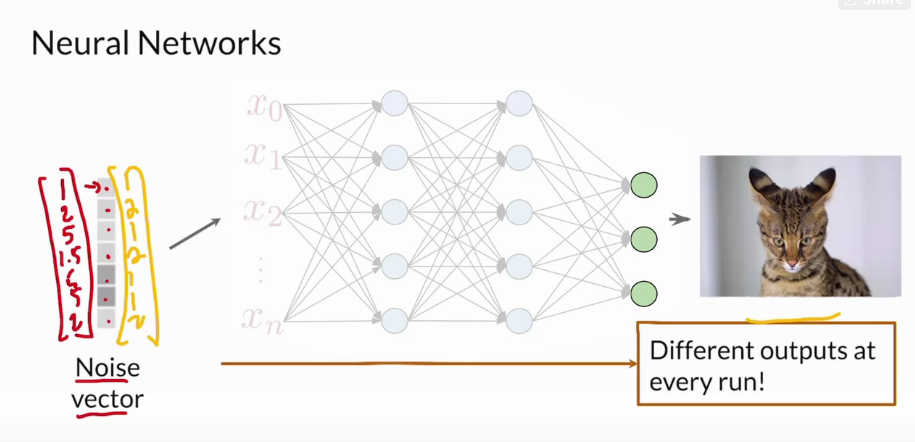
- Generate an output _q_, which isn't a class, but an image
   - If output image has 3 million pixels, there could be 3 million output nodes, each of which
     represents a pixel value
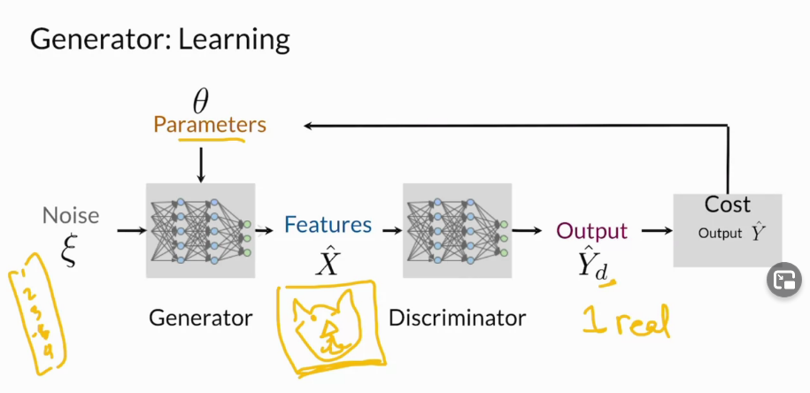
- Generator is trying to fool the Discriminator, so it wants $\hat{Y}_{d}$ to be zero (not in class)
  for members of the class, and one (in class) for non-members.
- A well-trained generator models $P(Y|X)$ well
   - If only 1 class (e.g. cat or ~cat), can eliminate the _Y_ term from the probability and have $P(X)$
      - This is just the probability that generator will create a good feature set
- Once you get a generator that creates good images, you can save the parameters $/theta$ of the 
  model 
   - Then feed new noise vectors into the generator to get different images
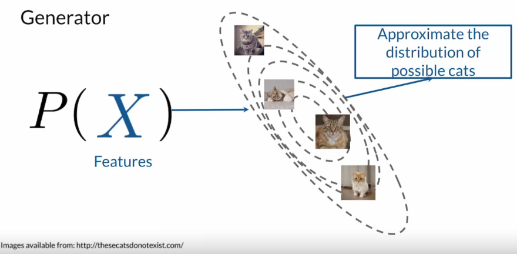
- More common cats will be more common in the distribution space than rare cats

### BCE Cost Function
- BCE == _Binary Cross Entropy_ function
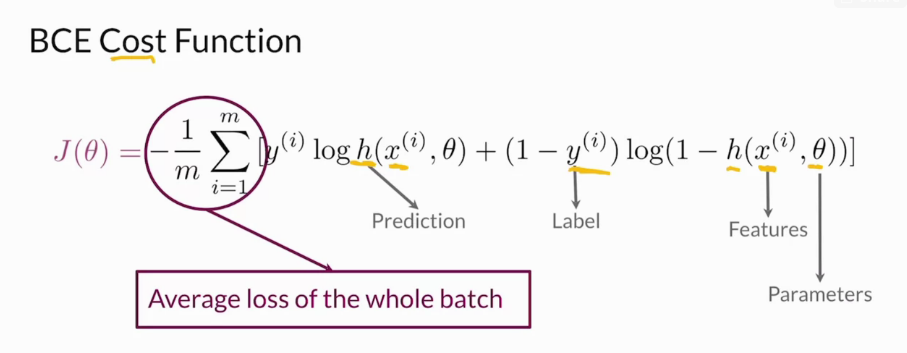
   - _m_ - number of examples in the training batrch (mini-batch)
   - _h_ - predictions made by the model
   - _y_ - labels for the training data (_true_ labels for whether something is real or fake)
   - _x_ - features passed through in a prediction
   - $\theta$ - are the parameters of whatever is computing a production, probably the discriminator

- First term of the cost function
   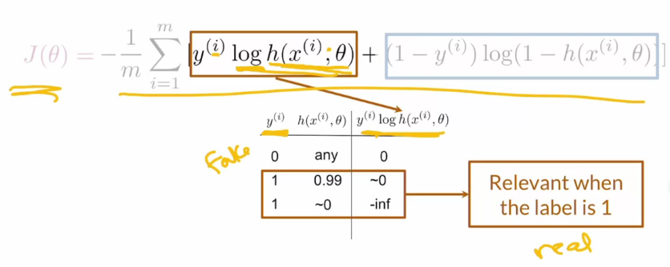

- Second term of the cost function
   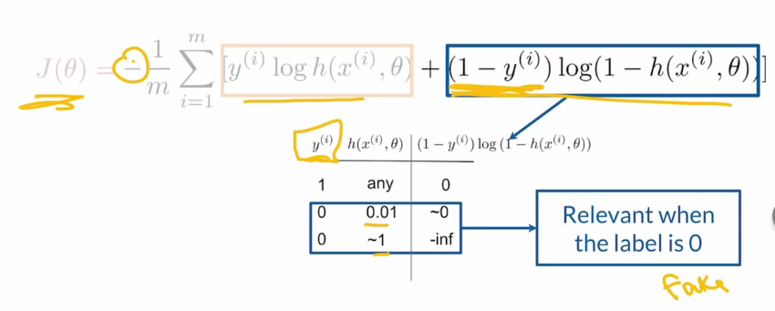

- Negative sign at the beginning of the equation ensures the cost is always >= 0

- Each term of the loss function represents a label (real/1, or fake/0)
   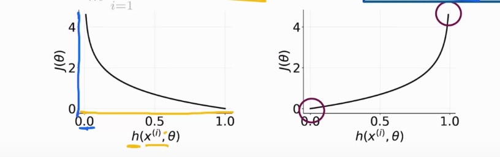
   - Function value is close to zero when the label and prediction are similar
   - Function value approaches infinity when the label and prediction are different
- BCE loss calculation is performed across a mini-batch of several examples and the
  total loss is averaged over the batches

### Putting it All Together
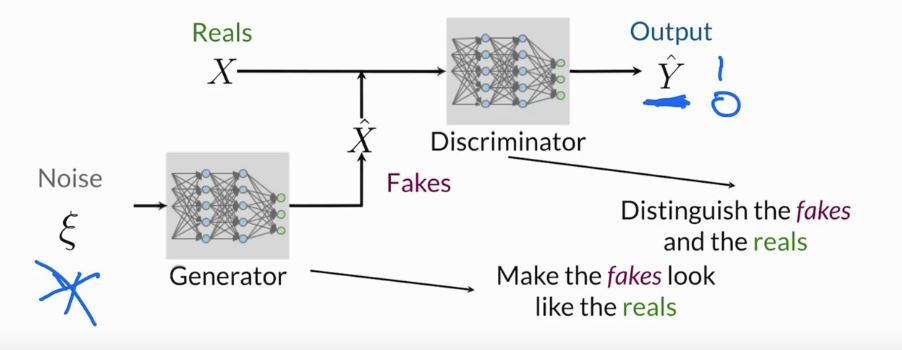

- Training the discriminator
   
   - Note: only the discriminator is updated

- Training the generator
   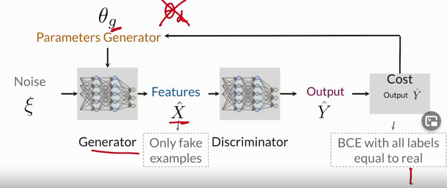
   - Note: only the generator is updated

- One model / component is trained while the other is held constant
   - Both models should be trained to similar levels (train together)
      - If discriminator is highly trained, will predict fakes with 100% accuracy, generator has no
        way to improve
      - If generator is more highly trained, discriminator will think that all generated images are
        100% real
- Discriminator's job is much easier than the generator
   - Trying to tell fake from real, not model the entire image space
- Common problem is when discriminator learns to quickly
   - Says all fakes are 100% fake.  Not helpful for the generator to learn

### Intro to PyTorch
- Pytorch - developed by Facebook
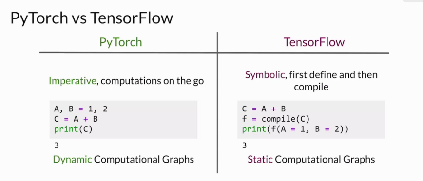
- With TF 2.0, eager execution makes TF more like dynamic computation
- Eash to move between frameworks, expecially in the TF -> PyTorch direction
- Defining a model in PyTorch
   
- Training models in PyTorch   
   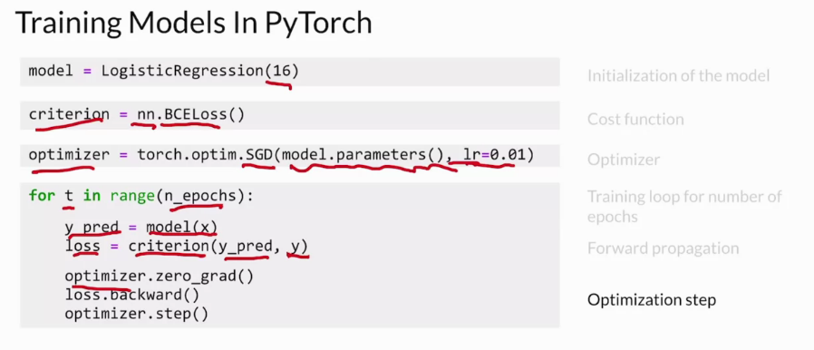
   