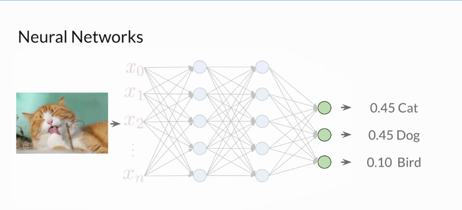

# Build Basic Generative Adversarial Networks (GANs)

## Week 1

### Generative Models
- 2 components, generators and and discriminators that compete against one another
- GANs are a _type_ of generative model
- Discriminative models often called _classifiers_

- Generative models usually try to create a realistic representation of some class
   - Takes a set of noise values as input, sometimes in a vector
      - So generator doesn't generate the same class features each time
   - May also take an input class
   - Goal: generate a set of features that look like the real class
- Many types of generative models
   - Variational AutoEncoders (VAEs)
      
       - Works with 2 models, usually NNs
       - Encoder - represents input image in latent space
          - Location can be represented as a vector of numbers
          - Generated a distribution of locations, and picks a point in the sitro to pass to decoder
       - Decoder - runs after encoder on encoded point, or some point close to it to generate
         something that belongs to the class
          - Assumes Decoder has been trained well to genewrate good class members
       - Once trained, Encoder isn't needed any more.  Just use decoder to generate
         class members
   - Generative Adversarial Networks (GANs)
      
      - 2 models as well
      - Generator
         - Generator takes in noise vector as well, and an optional class member
         - Role is very similar to Decoder in VAE
      - Discriminator
         - Unsupervised
         - Looking at fake and real class members, tring to discriminate
      - Over time, Generator and Discriminator compete against each other
      - At some point, can drop the discriminator, and generator can take in any random noise 
        to generate a believable class member
- Generative models learn to produce _realistic_ class members
- Discriminative models distinguish between classes

### Real Life GANs
- Ian Goodfellow - creator of GANs
- GANs can:
   - Transform images from one domain to another (e.g. horse <-> zebra)
   - Make rough drawings photo-realistic
   - Take a still portrait, and animate it, using a real person's face
   - Generate 3D object designs

### Intuition behind GANs
- Generator creates fakes that appear real to fool the discriminator
- Discriminator learns to discriminate between reall class members and fakes
- GAN starts with a set of real members
   - Generator isn't allowed access to the real member set
   - Discriminator originally can't tell real from fake
- Begin training the descriminator with a mix of real and fake
   - 5% real
   - 40% fake
   - Provide labels to supervise the learning process
- Generator learns to create better fakes by looking at member classification scores
  from the discriminator
- Training continues until GAN reaches the threshold of success required

### The Discriminator
- A Discriminator is a type of classifier
   - Classifiers distinguish between different classes
   
   - One type of classifier model is a _neural network_
      - Takes a set of features as input
      - Performs non-linear transformations in the hidden layers
      - Outputs probabilities for each classification

