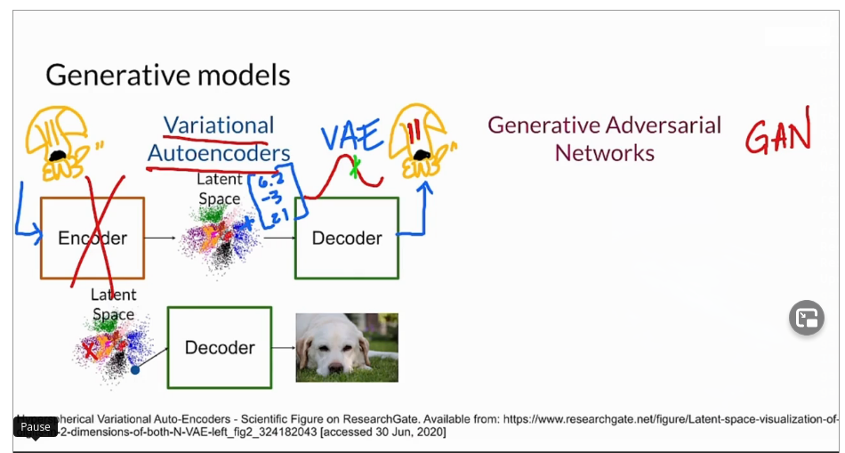

# Build Basic Generative Adversarial Networks (GANs)

## Week 1
- 2 components, generators and and discriminators that compete against one another
- GANs are a _type_ of generative model
- Discrriminative models often called _classifiers_

- Generative models usually try to create a realistic representation of some class
   - Takes a set of noise values as input, sometimes in a vector
      - So generator doesn't generate the same class features each time
   - May also take an input class
   - Goal: generate a set of features that look like the real class
- Many types of generative models
   
   - Variational AutoEncoders (VAEs)
       - Works with 2 models, usually NNs
       - Encoder - represents input image in latent space
          - Location can be represented as a vector of numbers
          - Generated a distribution of locations, and picks a point in the sitro to pass to decoder
       - Decoder - runs after encoder on encoded point, or some point close to it to generate
         something that belongs to the class
          - Assumes Decoder has been trained well to genewrate good class members
       - Once trained, encode isn't needed any more.  Just use decoder to generate
         class members
       
   - Generative Adversarial Networks (GANs)

