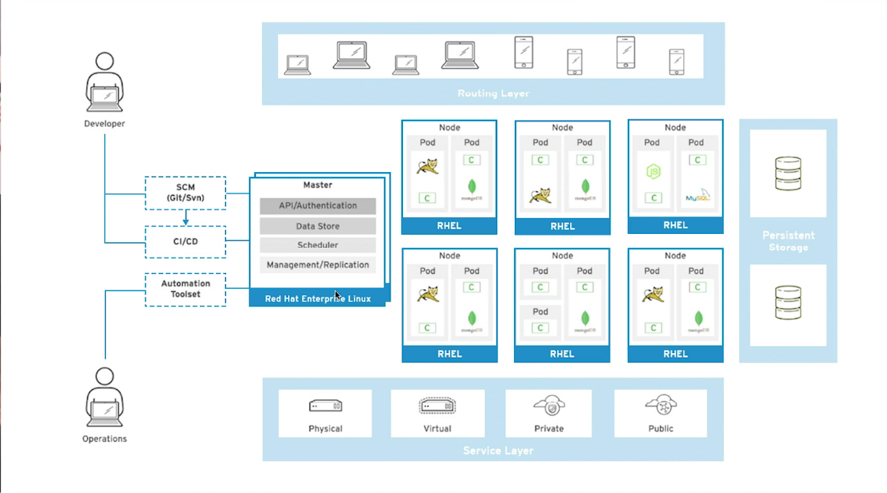
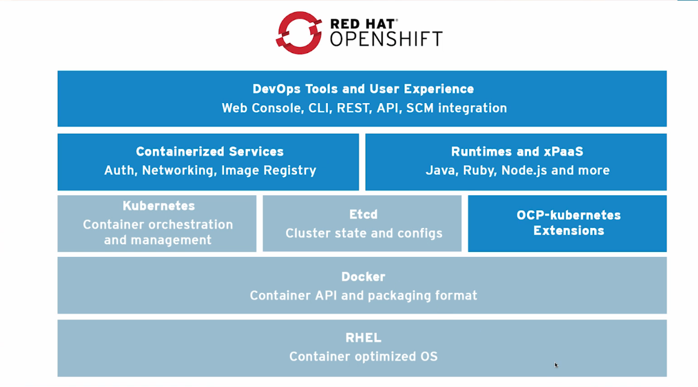
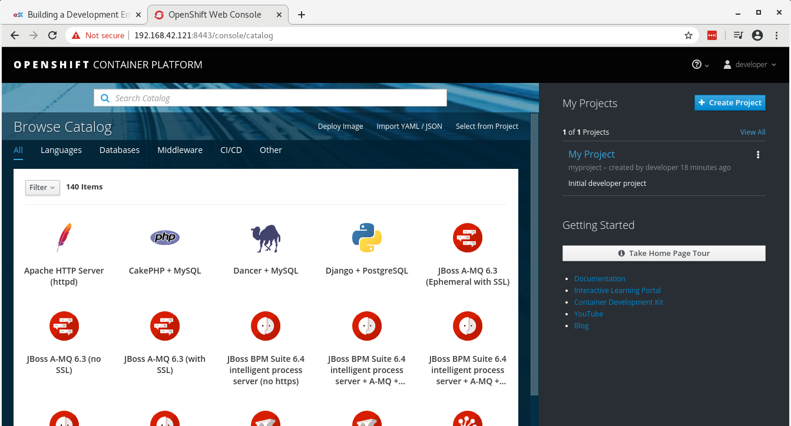

# Fundamentals of Containers, Kubernetes, and Red Hat OpenShift
_**EDX**_

## Chapter 1 - Getting Started with Container Technology
02/16/2020
- Kubernetes takes care of orchestration, scheduling, and isolation
   - Provides services, scheduling, isolation
- Master/worker architecture
- Pods - 1 or more containers that share resources
   - 1 container/1 pod is common
   - Use services to have a persistent IP address so pods can communicate
- Replication controllers - objects to help scale an application out
- Persistent volumes and claims used to persist data
   - Multiple containers on different hosts share persistent volumes
- OpenShift is a layer built upon containers and Kubernetes
   - Use to create CI/CD pipeline



- Services allow pods to communicate
- Deployment configurations represent pods created from the same container
  image



-----
04/22/2020
- Kubernetes handles orchestration, scheduling, isolation
   - Orchestration - how to get containers to talk to each other
      - Containers are transient, things like IP address can change
      - Kubernetes uses services to manage changing properties
   - Scheduling -
      - Maintain a certain number of container instances
      - Schedule instances based on system load
   - Isolation - prevent container failures from affecting each other
- Kubernetes manages clusters of pods
   - Master node runs commands via ```kube-control```
   - Pods are 1 or more containers that share an IP address
      - Common model is 1 container per pod, but possible to run more in a pod
   - Kube uses services to persist the IP address of a pod
   - Replication controllers scale applications out
   - Persistent volumes persist data
      - Persistent volume claims indicate which volumes a container needs access to
- OpenShift builds on top of Kube & containers
   - Web console - orchestrate & manage container cluster
      - Scale pods
      - Manage role-based access
      - Source image automation
   -

-----
04/26/2020
- Deployment configurations represent a set of pods created from the same container image
   - Helps a lot with rolling updates to base images
- Build configurations
   - Automate build processes for updates to images
- etcd - key value store used by Kubernetes
- Containerized services provided by OS are pods running in the background
- OS comes with all of the Runtimes and xPaaS included - lots of languages and
  API libraries


## Chapter 2 - Creating  Containerized Services
04/26/2020

Started an OS project cluster using all of the default settings.  This is a KVM-based
project that took about 15 minutes to completely setup.  I ran the ```minishift start```
command to kick off the project build process, and it provided this information
towards the end of the build process:

```
Creating initial project "myproject" ...
Server Information ...
OpenShift server started.

The server is accessible via web console at:
    https://192.168.42.121:8443/console

You are logged in as:
    User:     developer
    Password: <any value>

To login as administrator:
    oc login -u system:admin
```

I logged into the console as developer/spd95tpl



```
(base) /home/aragorn> minishift status
Minishift:  Running
Profile:    minishift
OpenShift:  Running (openshift v3.11.157)
DiskUsage:  14% of 19G (Mounted On: /mnt/sda1)
CacheUsage: 1.446 GB (used by oc binary, ISO or cached images)
RHSM: 	    Registered
```
