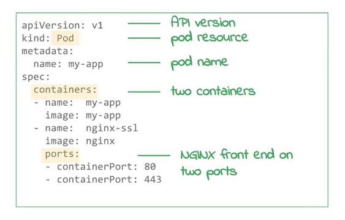

# Getting Started with Google Kubernetes Engine
## On Coursera
_**05/27/2019**_ 
_**05/31/2019**_ 
_**06/01/2019**_ 

## Clusters, Nodes, and Pods

- Upload YAML to a Kubernetes Master server, and the master will deploy it on
  one of the cluster nodes.
- A deployment ensures that _**N**_ pods are running in a cluster at any given
  time

## Services, Labels, and Selectors
- _Services_ facilitate communication between the pods
- Cluster has an internal IP addr, and the port nodes have access to that IP addr
- Also has a load balancer for the cluster

- A cluster can have multiple services running
   - Front end is usually a web or application server
   - Back end has the "nodes" (?) and database servers

- YAML file can also specify the load balancer
- _Labels_ are metadata that you can assign to any object to represent identity
   - Used for grouping, filtering, and searching objects in a deployment

- You can query (_select_) labels that map to a value, like the entire app
   - Can narrow a search for multiple labels
- Kubernetes does health checks on pods
   - Negative or no response means a pod is unhealthy
   - Results in a re-start of the pod, continues until we get to a healthy state
