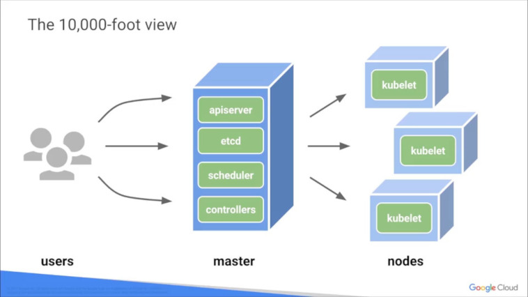

# Getting Started with Google Kubernetes Engine
## On Coursera
_**05/27/2019**_ 
_**05/31/2019**_ 
_**06/01/2019**_ 

- Upload YAML to a Kubernetes Master server, and the master will deploy it on
  one of the cluster nodes.
- A deployment ensures that _**N**_ pods are running in a cluster at any given
  time

